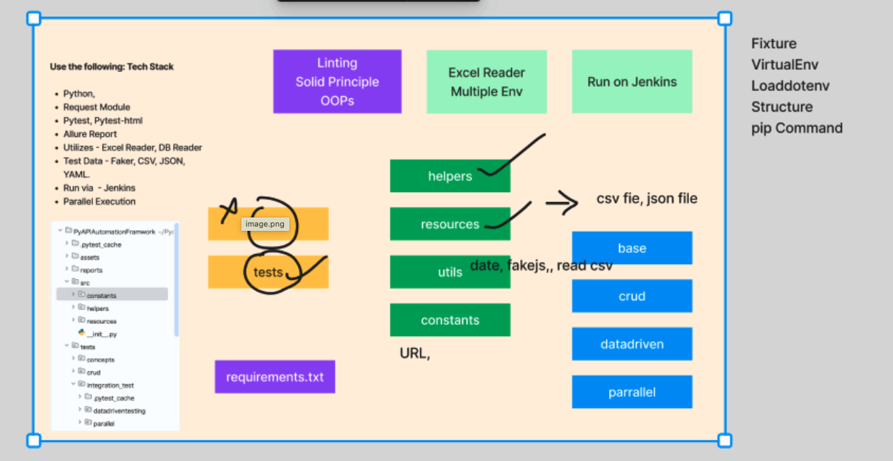

### This module will be about API testing automation framework

Hybrid API Automation framework using proper folder structure



## Tech Stack , that will be using
- Python - 3.12
- Requests - HTTP Requests
- PyTest - Testing Framework
- Reporting - Allure Report, PyTest HTML
- Test Data - CSV, Excel, JSON, Faker
- Advance API Testcase - jsonschema
- Parallel Execution - x distribute(xdist)

### How to install packages

pip install -r requirements.txt

### How to run Test case in parallel

```pip install pytest-xdist```

### How to add to the .gitignore file?

copy the content `you want to ignore` under .gitignore file

### How to run basic pytest with allure report

```tests/tests/crud/test_create_booking.py --alluredir=allure_report```

### Separation of components
1. Urls - will go under  `constants` folder
2. Headers - will go under `utils` folder
3. payload creation - will go under `helpers\payload_manager`
4. HTTP methods - will go under `helpers\api_request_wrappers`
5. common verification - will go under `helpers\common_verification`
